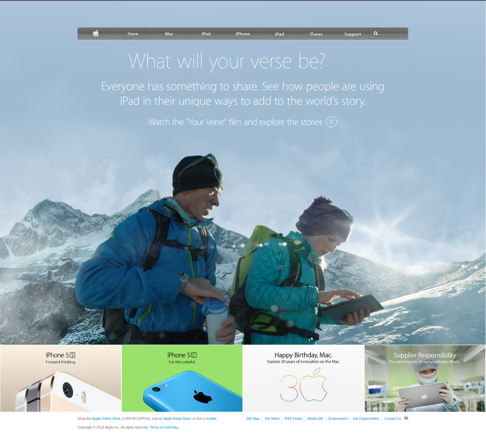

# The Odin Project: Clone of the Apple Home Page of 2014

> This is a clone of the old version of the 2014 [Apple website](https://web.archive.org/web/20140301004610/http://www.apple.com/)
> This project uses gradients to mimic the original navigation bar.

## Built With

- HTML
- CSS
- CSS Flexbox
- CSS Gradients

## Live Demo

[Live Demo Link](https://marcoshdezcam.github.io/gradients-apple-clone/)

## Authors

👤 **Marcos Hernández Campos**

- Github: [@marcoshdezcam](https://github.com/marcoshdezcam)
- Twitter: [@MarcosHCampos](https://twitter.com/MarcosHCampos)
- Linkedin: [Marcos Hernández](https://linkedin.com/marcos-hernández-56058119a/)

## 🤝 Contributing

Contributions, issues and feature requests are welcome!

Feel free to check the [issues page](issues/).

## Show your support

Give a ⭐️ if you like this project!

## 📝 License

This project doesn't require a license.
